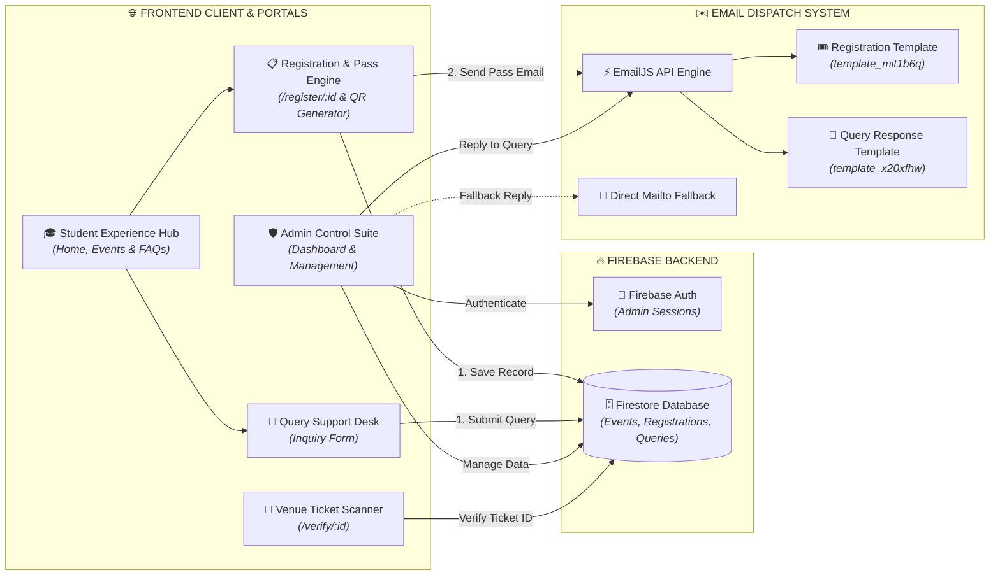

<div align="center">

# 🎓 Event Portal
### Next-Gen Campus Event Management & Pass Generation Platform

[](https://react.dev/)
[](https://vitejs.dev/)
[](https://tailwindcss.com/)
[](https://firebase.google.com/)
[](https://event-portal-tan.vercel.app)
[](LICENSE)

[🌐 **Live Demo Application**](https://event-portal-tan.vercel.app) &nbsp;|&nbsp; [📁 **GitHub Repository**](https://github.com/Mugilan-md/Event-portal)

---

</div>

## 📌 Executive Summary

**Event Portal** is a full-stack, futuristic event management and registration application designed for modern educational institutions, technical symposiums, and corporate conferences. 

Built with **React 19**, **Vite 8**, **Tailwind CSS v4**, and **Firebase**, the platform delivers an engaging student registration experience featuring **interactive 3D canvas visuals (60–120 FPS mobile optimized)**, **instant QR code event pass generation**, **automated dual-template EmailJS notifications**, and a comprehensive **Admin Operations Suite** for real-time attendance management, query resolution, and data export.

---

## 🏗️ System Architecture Diagram

The platform follows a decoupled, cloud-native architecture connecting the React single-page application (SPA), Firebase Firestore database, EmailJS notification engine, and venue ticket verification scanners.



---

## 🌟 Key System Features

### 👤 Student Experience Portal
* **Dynamic Event Showcase**: Real-time event discovery with category filters (Technical, Non-Technical, Workshops, Cultural), search bar, and status indicators.
* **Interactive Event Details**: Detailed event view complete with live countdown timers, schedule breakdowns, rules & guidelines, and venue coordinators.
* **Custom Registration Engine**: Support for individual and team registrations, custom input fields per event, poster preview, and dynamic form validation.
* **QR Pass & Confirmation**: Instant generation of unique QR-encoded digital entry tickets, downloadable/printable registration passes, and instant email confirmations sent via EmailJS.
* **Query Desk & FAQ Section**: Interactive FAQ accordion and a direct contact query submission interface with email status tracking.

### 🛡️ Admin Suite & Control Center
* **Secure Authentication**: Role-based authentication supporting Firebase Auth with fallback seamless local-storage admin provisioning.
* **Event Management (CRUD)**: Create, update, toggle active status, and delete events. Configure venue details, registration fees, maximum team sizes, and custom registration fields.
* **Registration Analytics & CSV Export**: Real-time registration table, category/event filtering, inline attendee data editing, and 1-click **CSV spreadsheet export** for venue desk check-ins.
* **Ticket Verification Engine (`/verify/:id`)**: Venue scanner endpoint to instantly verify attendee tickets via QR code or registration ID.
* **Query Resolution Portal**: Review student queries, send direct email replies with custom messages, and update resolution statuses in real time.

### ✨ Immersive UI / UX & Performance Enhancements
* **60–120 FPS Mobile 3D Engine**: Custom HTML5 Canvas particle/polyhedron engine (`Background3D.jsx`) with dynamic 1.0 DPR mobile scaling, disabled canvas `shadowBlur` on touch devices, and tab visibility frame pausing (`visibilitychange`).
* **Glittering Star Button Design System**: Interactive animated star button component (`StarButton.jsx`) applied across all action buttons (Navbar, Hero, Events, Registration, and Admin Console).
* **Dual-Template EmailJS Routing**: Distinct template routing between Event Registration Confirmations (`VITE_EMAILJS_TEMPLATE_ID`) and Query Responses (`VITE_EMAILJS_QUERY_TEMPLATE_ID`), with direct `mailto:` fallback.
* **High-Contrast Admin Typography**: High-legibility **Bright Light Sky Blue (`#38BDF8`)** table headers (`ATTENDEE NAME`, `COLLEGE`, `REGISTERED EVENT`, `TICKET CODE`, `DATE`) and solid dark contact support cards.
* **Micro-Animations & Visual Feedback**: Entrance transitions via Framer Motion, non-blocking animated toast notifications (`ToastContext.jsx`), and celebratory confetti upon registration success.

---

## 🛠️ Technology Stack

| Layer | Technologies Used |
| :--- | :--- |
| **Frontend Core** | React 19, React Router DOM v7, JavaScript (ES6+) |
| **Build Tool & HMR** | Vite 8, ESLint 10, React Compiler ready |
| **Styling & Design System** | Tailwind CSS v4, Lucide React Icons, HTML5 Canvas 3D |
| **Animations & FX** | Framer Motion v12, Canvas Confetti, StarButton Design Engine |
| **Backend & Database** | Firebase Firestore, Firebase Authentication, LocalStorage Fallback |
| **Email Service** | EmailJS Browser SDK (Dual Template Architecture + Mailto Fallback) |
| **QR Code Engine** | qrcode.react (SVG rendering) |
| **Deployment** | Vercel Serverless Hosting |

---

## 📁 Repository Architecture & Folder Structure

```text
Event-portal/
├── docs/                                    # System Documentation & Diagrams
│   ├── Database_Requirements_and_ER_Diagram.pdf
│   ├── Database_SQL_Schema.pdf
│   ├── Event_Registration_Portal_Modules.pdf
│   ├── Project_Presentation.zip
│   └── Use_Case_Diagram.pdf
├── public/                                  # Public Static Assets
├── src/
│   ├── assets/                              # Logos, branding graphics & SVG icons
│   ├── components/                          # Core Reusable UI Components
│   │   ├── CourseProgressCard.jsx
│   │   ├── Footer.jsx
│   │   ├── Navbar.jsx
│   │   ├── ProtectedRoute.jsx
│   │   ├── StudentDashboardHeader.jsx
│   │   └── ui/                              # Advanced 3D & Design System Components
│   │       ├── Background3D.jsx             # High FPS Mobile 3D Canvas
│   │       ├── Card3D.jsx                   # Non-blurring 3D Depth Card
│   │       ├── Icon3D.jsx                   # Multi-layered 3D Icon Badge
│   │       └── StarButton.jsx               # Glittering Star Button Component
│   ├── context/                             # React Context Providers
│   │   └── ToastContext.jsx                 # Global Toast Notification System
│   ├── firebase/                            # Firebase & Storage Configuration
│   │   └── config.js                        # Authentication & Firestore APIs
│   ├── pages/                               # Application Views & Routes
│   │   ├── AdminDashboard.jsx               # Main Admin Control Panel
│   │   ├── AdminLogin.jsx                   # Admin Authentication Portal
│   │   ├── EventDetails.jsx                 # Individual Event Overview Page
│   │   ├── Events.jsx                       # Public Event Discovery Hub
│   │   ├── Home.jsx                         # Landing Page with 3D Showcase & FAQ
│   │   ├── ManageEvents.jsx                 # Event Creation & Editing Suite
│   │   ├── ManageQueries.jsx                # Student Query Desk & Reply Portal
│   │   ├── ManageRegistrations.jsx          # Registration Records & CSV Export
│   │   ├── NotFound.jsx                     # Custom 404 Error View
│   │   ├── Registration.jsx                 # Participant Registration Form
│   │   ├── StudentDashboard.jsx             # Student Pass & History Overview
│   │   ├── Success.jsx                      # Pass Generation & Confirmation View
│   │   └── VerifyTicket.jsx                 # Venue QR Code Ticket Scanner View
│   ├── services/                            # External APIs & Services
│   │   └── emailService.js                  # EmailJS Integration Service
│   ├── App.jsx                              # Router Setup & Layout Wrappers
│   ├── index.css                            # Global Utility & Design System CSS
│   └── main.jsx                             # React Application Entrypoint
├── .env.example                             # Environment Variables Template
├── eslint.config.js                         # ESLint Configuration
├── index.html                               # HTML5 Entry Document
├── package.json                             # Dependencies & Scripts
├── vercel.json                              # Vercel Rewrites Configuration
└── vite.config.js                           # Vite Build System Configuration
```

---

## 📄 Documentation & System Architecture

Complete architectural blueprints and database requirements are available in the [`docs/`](docs/) directory:

* 📊 [**Database Requirements & ER Diagram**](docs/Database_Requirements_and_ER_Diagram.pdf)
* 🗄️ [**Database SQL Schema Specification**](docs/Database_SQL_Schema.pdf)
* ⚙️ [**Module & Functional Specifications**](docs/Event_Registration_Portal_Modules.pdf)
* 📐 [**Use Case Diagram**](docs/Use_Case_Diagram.pdf)
* 📦 [**Project Presentation Deck**](docs/Project_Presentation.zip)

---

## ⚡ Quick Start & Installation

### Prerequisites
* **Node.js**: v18.0.0 or higher
* **npm**: v9.0.0 or higher

### Step-by-Step Setup

1. **Clone the Repository**
   ```bash
   git clone https://github.com/Mugilan-md/Event-portal.git
   cd Event-portal
   ```

2. **Install Dependencies**
   ```bash
   npm install
   ```

3. **Configure Environment Variables**
   Create a `.env` file in the project root directory (use `.env.example` as a template):
   ```env
   # Firebase Configuration
   VITE_FIREBASE_API_KEY=your_api_key
   VITE_FIREBASE_AUTH_DOMAIN=your_auth_domain
   VITE_FIREBASE_PROJECT_ID=your_project_id
   VITE_FIREBASE_STORAGE_BUCKET=your_storage_bucket
   VITE_FIREBASE_MESSAGING_SENDER_ID=your_messaging_sender_id
   VITE_FIREBASE_APP_ID=your_app_id

   # EmailJS Configuration (Dual Template Setup)
   VITE_EMAILJS_SERVICE_ID=your_emailjs_service_id
   VITE_EMAILJS_TEMPLATE_ID=your_registration_emailjs_template_id
   VITE_EMAILJS_QUERY_TEMPLATE_ID=your_query_response_emailjs_template_id
   VITE_EMAILJS_PUBLIC_KEY=your_emailjs_public_key
   ```

4. **Launch Local Development Server**
   ```bash
   npm run dev
   ```
   Open your browser at `http://localhost:5173`.

---

## ⚙️ Available Scripts

In the project directory, you can run:

| Command | Description |
| :--- | :--- |
| `npm run dev` | Starts the Vite development server with Hot Module Replacement (HMR). |
| `npm run build` | Bundles the application into production-ready assets inside `/dist`. |
| `npm run lint` | Runs ESLint to verify code quality and adherence to React 19 standard rules. |
| `npm run preview` | Serves the production build locally for verification. |

---

## 🛡️ License & Author

Developed with ❤️ by **Mugilan MD**

* **GitHub**: [@Mugilan-md](https://github.com/Mugilan-md)
* **Repository**: [https://github.com/Mugilan-md/Event-portal](https://github.com/Mugilan-md/Event-portal)

This project is licensed under the **MIT License** — feel free to use and adapt for campus and community events!

